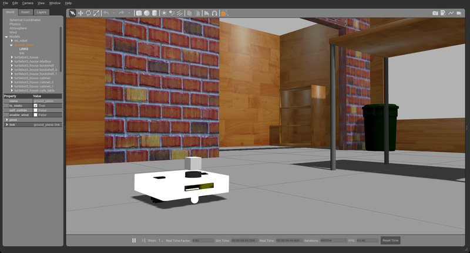

## Overview

Implemented and fine-tuned the ROS Navigation Stack for an indoor service robot built by And Robotics. The robot was designed to operate autonomously in tight office environments — navigating narrow corridors, doorways, and cluttered workspaces. This was a freelance project carried out with **A.T.O.M Robotics Lab** as team lead.

## Key Features

- **Nav Stack Tuning** — Customized costmap parameters, local planner, and recovery behaviors for reliable navigation in confined office spaces
- **Tight-space Navigation** — Fine-tuned inflation radii, obstacle layers, and planner tolerances to handle narrow corridors and doorways
- **SLAM Integration** — Mapping of office environments for localization and goal-based navigation
- **Deployment-ready** — Tuned and tested for real-world office deployment with smooth obstacle avoidance

## Role

Team Lead — A.T.O.M Robotics Lab (Freelance)

## Tech Stack

`ROS` · `Navigation Stack` · `SLAM` · `Python` · `C++`
