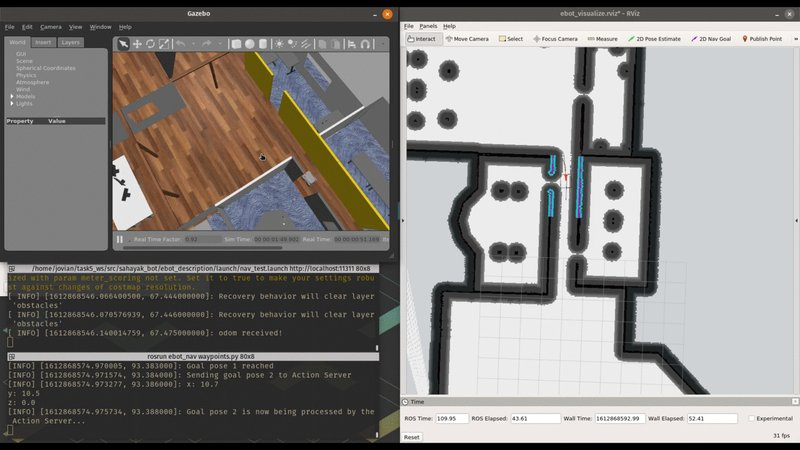

## Overview

Built an autonomous mobile manipulator for the **e-Yantra Robotics Competition (EYRC) 2021** organized by IIT Bombay. The robot autonomously navigates an arena, detects objects using computer vision, and performs pick-and-place operations to complete task objectives.

## Key Features

- **Autonomous Navigation** — SLAM and path planning for arena traversal with dynamic obstacle handling
- **Object Detection & Manipulation** — Vision-based detection and robotic arm pick-and-place for task completion
- **End-to-end Autonomy** — Fully autonomous pipeline from perception to planning to execution without human intervention
- **Competition Tested** — Iterated through multiple rounds of increasingly complex arena challenges

## Achievement

**6th Position** among **500+ teams** nationwide

## Competition

e-Yantra Robotics Competition (EYRC) 2021 — IIT Bombay

