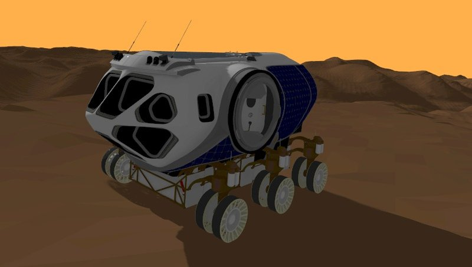

## Overview

Contributed custom Gazebo plugins and terrain models to the [Space ROS](https://github.com/space-ros/demos/pull/40) project — NASA's open-source ROS2 framework for space robotics. The work introduces realistic environmental effects and planetary terrains derived from actual NASA Planetary Data System elevation data for Mars and Moon exploration simulations.

## Key Features

- **Planetary Terrain Models** — Mars (Gale Crater) from HiRISE imagery and Lunar terrain from LOLA data, built from real elevation datasets
- **DustManager Plugin** — Simulates Martian dust storms using ParticleEmitters, injecting visual noise and wind effects into sensor data with an interactive GUI
- **DayLightManager Plugin** — Realistic solar trajectory based on latitude and time-of-day, with dynamic scene color adjustments and lens flare affecting camera sensors
- **VehicleDust & DroneDust Plugins** — Reactive dust effects triggered by rover and drone motion on planetary surfaces
- **Curiosity Rover Demos** — Launch files for Curiosity rover scenarios on Mars terrain with full environmental effects

## Tech Stack

`ROS2 Humble` · `Gazebo Harmonic` · `C++` · `Docker` · `Space ROS`

