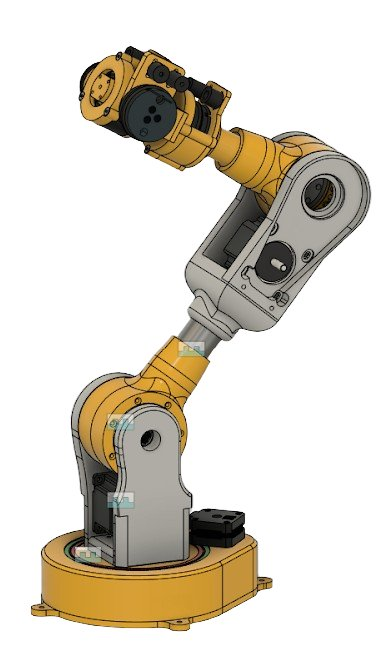

## Overview

Developed a VR-based teleoperation system for controlling a robotic manipulator in real time. The operator uses a VR headset and controllers to intuitively command the arm's end-effector pose, with the robot mirroring movements in the physical workspace. Built in collaboration with **Technoyantra Research**.

## Key Features

- **Immersive Teleoperation** — 1:1 mapping of VR controller pose to robot end-effector for intuitive control
- **Real-time Feedback** — Live 3D visualization of the robot state and workspace in the VR environment
- **Collision-aware Planning** — Motion commands filtered through collision checking before execution on hardware
- **Workspace Scaling** — Configurable scaling between VR space and robot workspace for precision tasks

## Collaboration

Technoyantra Research

